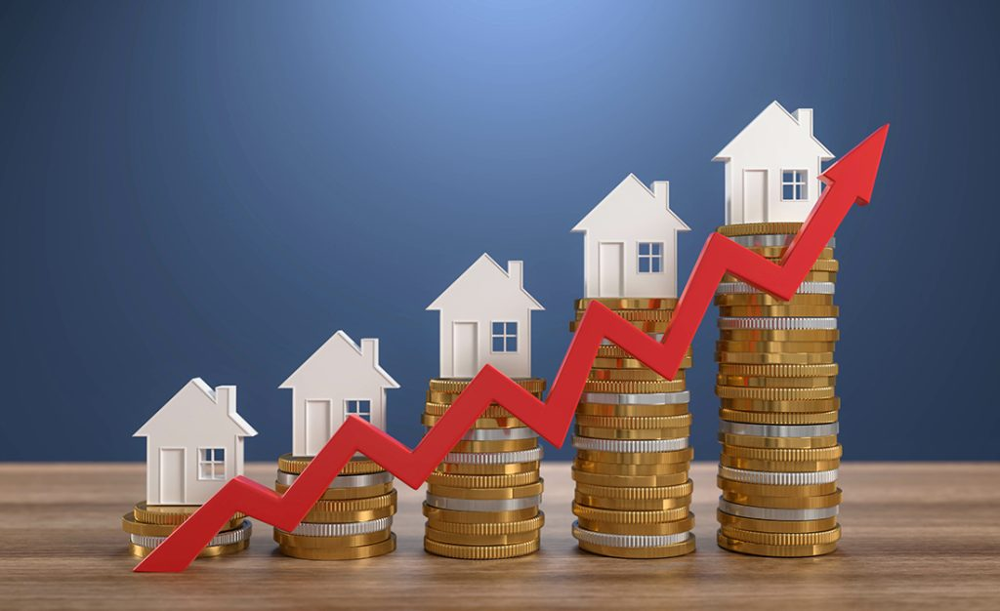

# 🏠 Housing Price Regression

<div align="center">
  
</div>

A beginner-friendly end-to-end project for predicting house prices using regression techniques.  
This project demonstrates data exploration with SQL and Python, exploratory data analysis (EDA), machine learning model selection, hyperparameter tuning, and model deployment.

---

## Table of Contents

- [🏠 Housing Price Regression](#-housing-price-regression)
  - [Table of Contents](#table-of-contents)
  - [About the Dataset](#about-the-dataset)
  - [Project Structure](#project-structure)
  - [Getting Started](#getting-started)
  - [Queries in SQL](#queries-in-sql)
  - [Exploratory Data Analysis](#exploratory-data-analysis)
  - [Machine Learning](#machine-learning)
- [Conclusion](#conclusion)

---

## About the Dataset

- **Source:** [Kaggle: Home Value Insights](https://www.kaggle.com/datasets/prokshitha/home-value-insights)
- **Rows:** 1000
- **Features:**  
  - `Square_Footage`: Size of the house in square feet  
  - `Num_Bedrooms`: Number of bedrooms  
  - `Num_Bathrooms`: Number of bathrooms  
  - `Year_Built`: Year the house was built  
  - `Lot_Size`: Lot size in acres  
  - `Garage_Size`: Number of cars the garage can fit  
  - `Neighborhood_Quality`: Neighborhood quality rating (1-10)  
  - `House_Price`: Target variable (price of the house)

---

## Project Structure

<pre>
├── house_price_regression_dataset.csv 
├── housing_price.ipynb 
├── best_housing_price_model.pkl 
├── scaler.pkl 
├── README.md 
</pre>

---

## Getting Started

1. **Clone the repository:**
    ```bash
    git clone https://github.com/yourusername/housing-price-regression.git
    cd housing-price-regression
    ```

2. **Install dependencies:**
    ```bash
    pip install -r requirements.txt
    ```

3. **Run the Jupyter notebook:**
    ```bash
    jupyter notebook housing_price.ipynb
    ```

---

## Queries in SQL

- **Descriptive Statistics:**  
  - Calculated average, minimum, and maximum house prices.
  - Computed average values for square footage, bedrooms, bathrooms, lot size, and garage size.

- **Trends and Grouping:**  
  - Found average house price grouped by number of bedrooms, neighborhood quality, and year built.

- **Correlation and Relationships:**  
  - Explored the relationship between square footage and price.
  - Grouped houses by lot size (small, medium, large) and computed average price for each group.

- **Filtering and Segmentation:**  
  - Retrieved houses built after 2010.
  - Selected houses with more than 3 bedrooms and more than 2 bathrooms.
  - Identified houses in the top 10% of prices using a percentile calculation.

- **Outlier Detection:**  
  - Listed houses with a lot size greater than 4 acres.

- **Aggregations:**  
  - Counted the number of houses per neighborhood quality.
  - Summed house prices by year built.

- **Top/Bottom Listings:**  
  - Displayed the top 10 most expensive and bottom 10 least expensive houses.

---

## Exploratory Data Analysis

- **Data Overview:**  
  - Checked the shape, info, and summary statistics of the DataFrame.
  - Examined data types, missing values, and duplicate rows.

- **Numerical Features:**  
  - Plotted histograms for all numerical features to visualize their distributions.

- **Categorical Features:**  
  - Used count plots to show the distribution of bedrooms, bathrooms, garage size, and neighborhood quality.

- **Outlier Detection:**  
  - Visualized outliers in square footage, lot size, and house price using boxplots.

- **Correlation Analysis:**  
  - Displayed a heatmap of correlations between all numerical features.

- **Bivariate Analysis:**  
  - Plotted scatterplots of house price against each numeric feature.
  - Used boxplots to show house price distributions by categorical features.

- **Year Built Analysis:**  
  - Plotted a line chart to show house price trends over years.

- **Summary Statistics by Group:**  
  - Bar plots of average house price by number of bedrooms and by neighborhood quality.

---

## Machine Learning

- **Data Preparation:**  
  - Separated features from target and split data into training and test sets.

- **Feature Scaling:**  
  - Standardized features to have mean 0 and variance 1.

- **Model Selection and Training:**  
  - Trained Linear Regression, Ridge, Lasso, Random Forest, and Gradient Boosting models.
  - Compared models using MSE, MAE, and R².

- **Cross-Validation:**  
  - Evaluated each model using cross-validation on the training set.

- **Hyperparameter Tuning:**  
  - Used GridSearchCV to find the best combination of hyperparameters for Random Forest.

- **Evaluate the Best Model:**  
  - Evaluated the best model on the test set using MSE, MAE, and R².

- **Save the Model and Scaler:**  
  - Saved the trained model and scaler to disk for future use.

- **Load and Use the Model Later:**  
  - Loaded the saved model and scaler, and made a prediction on a sample.

---

# Conclusion

Through SQL queries, we explored the dataset's structure, trends, and outliers, gaining insights into how features like square footage, bedrooms, and neighborhood quality affect house prices.  
EDA confirmed these relationships visually and statistically, revealing strong correlations and the presence of outliers.  
In the machine learning phase, several regression models were compared, with Random Forest (after hyperparameter tuning) delivering the best predictive performance.  
The final model was saved for deployment, demonstrating a complete workflow from data exploration to model deployment.

**Key Findings:**
- House price is most strongly influenced by square footage, lot size, and neighborhood quality.
- Random Forest regression provided the best results for this dataset.
- The workflow is robust and can be adapted for similar regression problems in real estate or other domains.

---
